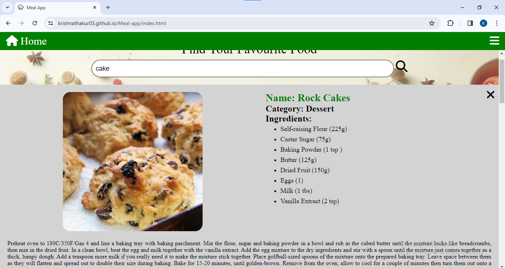

# Meal app

This is Api based frontend project of Coding Ninja, in this project I used HTML, CSS and vanilla Javascript.
Basicaly it finds meal/food recipe for you.

## Screenshots
- Landing page -

- After search meal -

- Meal/Food detail section -

- Favourite section -

## Demo

👉 [Meal app](https://krishnathakur03.github.io/Meal-app/)

## Authors

- [@krishnathakur03](https://www.github.com/krishnathakur03)

- 

## 🛠 Skills
Javascript, HTML, CSS...

## Lessons Learned

I learn lot of things in this project, mainely I found new way to style and select elements. Only challenge that I face to build this how the structure goes. I try more way some of them not looks good then at last I found my structure (I also take help of Google to make structure).

## Api used for data

`https://www.themealdb.com/api.php`

## Feedback

If you have any feedback, please reach out to us at krishnatk706@gmail.com
